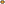
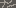
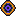
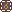
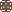
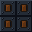

# Trabajo-BCMS

<h3>Integrantes</h3>

**Sofía Koprcina** &nbsp;•&nbsp; **Ciro Pregot** &nbsp;•&nbsp; **Matías Rubio** &nbsp;•&nbsp; **Benicio Sánchez Mandato**

<h3>Arkanoid</h3>

El juego consiste en controlar una barra horizontal ubicada en la parte inferior de la pantalla que se mueve de izquierda a derecha. El objetivo principal es mantener en juego una bola que rebota constantemente, evitando que caiga fuera de la pantalla, y dirigirla para impactar contra una serie de bloques ubicados en la parte superior. El juego corre en una resolución de **320×240 píxeles con 8 bits por píxel**, desarrollado íntegramente en **lenguaje ensamblador para una arquitectura de 16 bits**.

Cada vez que la bola golpea un bloque, este puede desaparecer o resistir varios impactos dependiendo de sus características. La dirección que toma la bola después de cada rebote depende del punto de contacto con la barra, lo que introduce un componente de control y precisión.

Durante la partida pueden aparecer elementos que modifican el comportamiento del juego, como cambios en el tamaño de la barra, la cantidad de bolas en pantalla o la forma de interactuar con los bloques. El desafío aumenta progresivamente debido a la velocidad de la bola y la complejidad de los niveles. Toda esta lógica —incluyendo la detección de colisiones, el manejo de sprites y la generación de los niveles— se implementa directamente sobre el hardware mediante rutinas en assembler, sin el uso de motores o bibliotecas externas.

En el nivel aparecen también enemigos que se desplazan por la pantalla e interfieren con la trayectoria de la bola, añadiendo una capa adicional de dificultad. El jugador dispone de un número limitado de vidas, perdiéndose una cada vez que la bola cae por la parte inferior sin ser interceptada por la plataforma. La puntuación se acumula en función de la cantidad de bloques destruidos, los enemigos eliminados y las cápsulas recogidas.

<h2>Historia del Juego</h2>

La nave nodriza **ARKANOID** navega por el universo hasta ser atacada por **DOH**, una entidad cósmica que controla el tiempo y las dimensiones. El impacto destruye la nave y lanza al **Vaus** —su plataforma de combate— a una dimensión alternativa controlada por DOH. Atrapado y sin posibilidad de retorno, el Vaus emprende su camino hacia DOH con un único objetivo: derrotarlo y restaurar todo lo destruido.

<h4>Desarrollo</h4>

El juego se estructura en **seis niveles** ambientados en esta dimensión, con estética steampunk de vapor, engranajes y hierro. En los primeros cinco, cada nivel presenta bloques simples que se destruyen en un impacto y bloques reforzados que requieren varios golpes. Al destruirse, algunos liberan **power-ups** que modifican temporalmente el juego: tamaño del Vaus, cantidad de bolas activas, velocidad, entre otros. También aparecen enemigos mecánicos que se eliminan cuando la bola los impacta, pudiendo alterar su trayectoria al hacerlo. El jugador dispone de **5 vidas**, perdiéndose una cada vez que la bola cae por el borde inferior. La puntuación se acumula según los bloques destruidos, los enemigos eliminados y los power-ups recogidos.

<h4>Desenlace</h4>

El **sexto nivel** enfrenta al Vaus contra **DOH** directamente, un jefe de alta resistencia que debe recibir múltiples impactos para ser derrotado. Al caer DOH, su control sobre el tiempo colapsa: el tiempo comienza a fluir hacia atrás, restaurando la nave **ARKANOID**. El Vaus logra acoplarse a ella y continuar su aventura, con el universo finalmente restaurado.

---

## Sprites

Sección que muestra los sprites utilizados en el juego. Dado que el juego corre en una baja resolución, los sprites originales son pequeños (de pocos píxeles) y se muestran aquí ampliados a escala **4x** para apreciar mejor su diseño en el navegador.

### Jugador y Bola

| Sprite | Nombre | Dimensiones Originales |
| :---: | :--- | :---: |
|  | **Vaus** (Plataforma del jugador) | 48×8 px |
|  | **Bola** | 5×4 px |

### Bloques Comunes

| Sprite | Tipo | Dimensiones Originales | Sprite | Tipo | Dimensiones Originales |
| :---: | :--- | :---: | :---: | :--- | :---: |
|  | **Bloque Rojo** | 16×8 px |  | **Bloque Azul** | 16×8 px |
|  | **Bloque Verde** | 16×8 px |  | **Bloque Amarillo** | 16×8 px |
|  | **Bloque Rosa** | 16×8 px |  | **Bloque Naranja** | 16×8 px |
|  | **Bloque Gris** | 16×8 px |  | **Bloque Morado** | 16×8 px |
|  | **Bloque Marrón** | 16×8 px |  | **Bloque Pastel** | 16×8 px |

### Bloques Especiales

| Sprite | Estado / Tipo | Dimensiones Originales |
| :---: | :--- | :---: |
|  | **Plata** (Resistente) | 16×8 px |
|  | **Plata Dañado** | 16×8 px |
|  | **Dorado** (Resistente) | 16×8 px |
|  | **Dorado Dañado (Fase 1)** | 16×8 px |
|  | **Dorado Dañado (Fase 2)** | 16×8 px |
|  | **Diamante** (Indestructible) | 16×8 px |

### Enemigos

| Sprite | Nombre | Dimensiones Originales |
| :---: | :--- | :---: |
|  | **Enemigo Diamante** | 16×16 px |
|  | **Enemigo Engranaje** | 16×16 px |

### Objetos y Power-ups

| Sprite | Nombre | Dimensiones Originales |
| :---: | :--- | :---: |
|  | **Power-up Bomba** | 12×12 px |
|  | **Power-up Pelota** | 12×12 px |

### Otros / Fondos

| Sprite | Nombre | Dimensiones Originales |
| :---: | :--- | :---: |
|  | **Textura de Fondo** | 32×32 px |